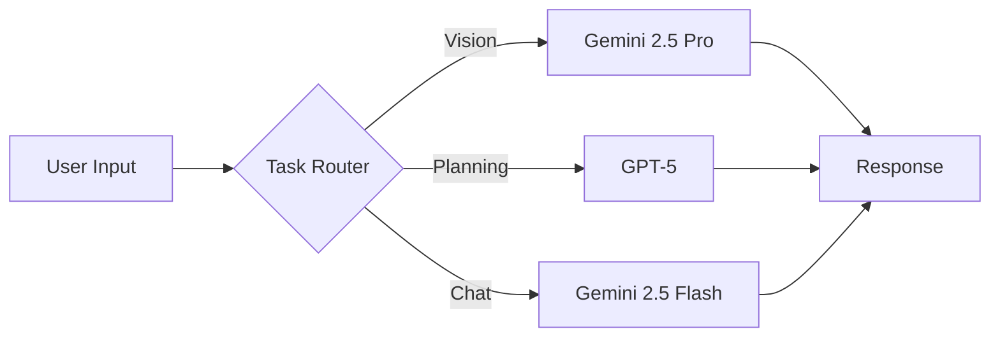

# Architecture Decision Records (ADR)

## Overview
This document captures key architectural decisions for the AI Body Composition Analyzer project, leveraging the latest AI technologies available in 2025.

## ADR-001: AI Provider Strategy

### Status
Accepted

### Context
We need to integrate multiple AI models for different tasks:
- Visual analysis of body composition photos
- Natural conversation in Portuguese
- Complex meal plan generation
- Cost optimization

### Decision
Use **Vercel AI Gateway** with **AI SDK 5** for unified provider management:

1. **Primary Setup**: Vercel AI Gateway
   - Single API key management
   - Zero markup pricing
   - Automatic failover
   - Usage tracking in one dashboard
   - Production-ready (GA as of 2025)

2. **Model Selection**:
   - **Gemini 2.5 Pro**: Vision analysis (84.8% VideoMME benchmark)
   - **GPT-5**: Complex meal planning (94.6% AIME 2025)
   - **Gemini 2.5 Flash**: Fast chat responses (cost-effective)

3. **Fallback Strategy**: Use alternate models via Gateway routing

### Consequences
✅ Simplified API management
✅ Cost transparency (zero markup)
✅ Easy model switching
✅ Built-in reliability
❌ Dependency on Vercel infrastructure
❌ Need to purchase credits upfront

## ADR-002: AI SDK 5 Features Utilization

### Status
Accepted

### Context
AI SDK 5 brings significant improvements over v4:
- Type-safe chat with custom message types
- Data parts for streaming arbitrary data
- Enhanced tool calling with MCP alignment
- Native speech capabilities
- Multi-framework support

### Decision
Leverage AI SDK 5's advanced features:

1. **Type-Safe Streaming**: Custom message types for our domain
2. **Tool Calling**: Integrate BMR/TDEE calculations as tools
3. **Data Parts**: Stream analysis progress and metrics
4. **Lifecycle Hooks**: Monitor token usage and performance

### Implementation
```typescript
// Custom message type for our domain
interface BodyAnalysisMessage {
  role: 'user' | 'assistant' | 'analysis';
  content: string;
  metrics?: AnalysisMetrics;
  images?: string[];
}

// Stream with data parts
const result = streamText<BodyAnalysisMessage>({
  model,
  tools: { calculateBMR, analyzePose },
  onComplete: (result) => trackUsage(result.usage)
});
```

## ADR-003: Multi-Model Architecture

### Status
Accepted

### Context
Different AI models excel at different tasks. We need optimal performance for each feature.

### Decision
Implement task-specific model routing:



### Task Allocation
| Task | Model | Reasoning |
|------|-------|-----------|
| Body photo analysis | Gemini 2.5 Pro | Superior vision capabilities (multimodal native) |
| Meal plan generation | GPT-5 | Best reasoning (88.4% GPQA), thinking mode |
| General chat | Gemini 2.5 Flash | Fast, cost-effective, Portuguese fluency |
| BMR/TDEE calculation | Native JS | Deterministic, no AI needed |

## ADR-004: Streaming Architecture

### Status
Accepted

### Context
Users expect immediate feedback, especially in health/fitness applications.

### Decision
Implement streaming-first architecture:

1. **Chat**: Stream responses token by token
2. **Analysis**: Stream progress updates during processing
3. **Meal Plans**: Stream sections as generated

### Implementation
```typescript
// Progressive streaming with status updates
export async function analyzeImages(images: File[]) {
  const stream = new TransformStream();
  const writer = stream.writable.getWriter();

  // Stream progress
  writer.write({ status: 'uploading', progress: 0 });
  // ... process images
  writer.write({ status: 'analyzing', progress: 50 });
  // ... run AI analysis
  writer.write({ status: 'complete', data: results });

  return new Response(stream.readable);
}
```

## ADR-005: Cost Optimization Strategy

### Status
Accepted

### Context
AI API costs can escalate quickly. Need to balance quality with economics.

### Decision
Implement tiered model usage:

1. **Default Path**: Gemini 2.5 Flash (cheapest)
2. **Vision Tasks**: Gemini 2.5 Pro (only when needed)
3. **Complex Planning**: GPT-5 (user-triggered)

### Cost Controls
- Cache common responses (meal templates)
- Limit image sizes before upload
- Use token limits appropriately
- Monitor usage via AI Gateway dashboard

## ADR-006: Privacy & LGPD Compliance

### Status
Accepted

### Context
Brazilian LGPD requires strict data protection. Health data is sensitive.

### Decision
Implement zero-persistence architecture:

1. **No Database**: All data in memory only
2. **No Cookies**: Session management via React state
3. **No Analytics**: Privacy-first approach
4. **Image Processing**: Stream processing, no storage
5. **Clear Consent**: Explicit opt-in before processing

### Implementation
```typescript
// Memory-only session management
const sessions = new Map<string, SessionData>();

// Auto-cleanup after 30 minutes
setTimeout(() => sessions.delete(sessionId), 30 * 60 * 1000);
```

## ADR-007: Error Handling & Resilience

### Status
Accepted

### Context
AI services can fail. Need graceful degradation.

### Decision
Multi-layer error handling:

1. **Primary**: AI Gateway automatic failover
2. **Secondary**: Fallback models
3. **Tertiary**: Cached/template responses
4. **Last Resort**: User-friendly error messages

### Implementation
```typescript
async function getAIResponse(prompt: string) {
  try {
    // Try primary model via Gateway
    return await gateway.model('gemini-2.5-pro').generate(prompt);
  } catch (e1) {
    try {
      // Fallback to Flash
      return await gateway.model('gemini-2.5-flash').generate(prompt);
    } catch (e2) {
      // Return template response
      return getTemplateResponse(prompt);
    }
  }
}
```

## ADR-008: Development vs Production Configuration

### Status
Accepted

### Context
Need flexibility during development while ensuring production stability.

### Decision
Environment-based configuration:

```typescript
const config = {
  development: {
    useGateway: true,  // Always route through AI Gateway
    debug: true,
    mockData: true
  },
  production: {
    useGateway: true,  // AI Gateway enforced
    debug: false,
    mockData: false
  }
};
```

## ADR-009: Conversion Optimization Architecture

### Status
Accepted

### Context
Primary goal is lead generation for consultations.

### Decision
Strategic CTA placement based on:
1. Time spent (>3 minutes)
2. Message count (>5 messages)
3. Complexity triggers (advanced questions)
4. Success moments (after showing results)

### Implementation
```typescript
const conversionTriggers = {
  timeBasedCTA: (sessionTime) => sessionTime > 180000,
  engagementCTA: (messageCount) => messageCount > 5,
  complexityCTA: (questionType) => questionType === 'advanced',
  successCTA: (resultShown) => resultShown === true
};
```

## ADR-010: Tech Stack Minimalism

### Status
Accepted

### Context
Avoid over-engineering. Ship fast, iterate based on data.

### Decision
Minimal dependencies:
- Next.js 15 (framework)
- AI SDK 5 (AI integration)
- Tailwind CSS (styling)
- Lucide React (icons)
- Zod (validation)

No additions without proven need.

---

## Decision Log

| Date | Decision | Status |
|------|----------|--------|
| 2025-09-26 | Use AI Gateway for unified access | Accepted |
| 2025-09-26 | Implement multi-model architecture | Accepted |
| 2025-09-26 | Streaming-first approach | Accepted |
| 2025-09-26 | Zero-persistence for LGPD | Accepted |
| 2025-09-26 | Minimal tech stack | Accepted |

## Review Schedule
Review these decisions after:
- First 100 users
- First week of production
- Any major incident

---

**Last Updated:** September 26, 2025
**Next Review:** After MVP deployment
